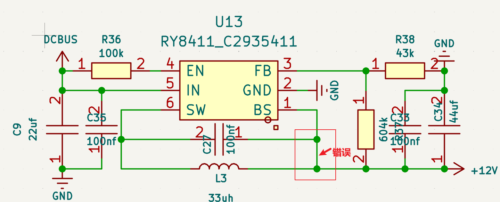

# Three-axis gimbal

Status: In progress  
Sort: Prj

## TODO
- [x]  改进云台结构，4310电机承重2025-12-15 22:16:56
- [x]  等元器件，焊接2025-12-23 23:06:42
- [x]  改PCB sample LSB问题 dcdc啸叫2025-12-24 17:22:35
- [x]  等待PCB Ver1.12025-12-28 10:10:11
- [x]  焊接第二版 2025-12-28 19:04:43
- [ ]  开始打印结构件

---

## Structure

### Ver1.0

  

### Ver1.1：底部加入支撑转盘

  

---

## Hardware

### Mini_Drv Ver1.0

   
   
  

### Mini_Drv Ver1.1

   
   
  

---

## Software

### pid参数

  

---

## Problems

- DCDC部分，错误地将芯片BS引脚与输出连在一起。
- MOS啸叫，未找到原因。纠正：MOS不会啸叫，压电类器件更易啸叫。

  

